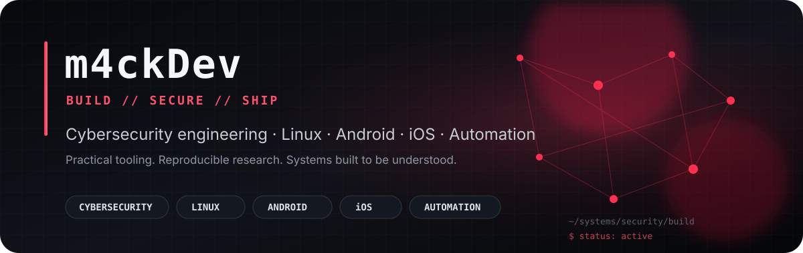

  

  
  
  

  <strong>Cybersecurity Engineer · Linux Engineer · Android/iOS Developer · Automation Builder</strong>

  Build the system. Break down the problem. Prove the result. Document it so somebody else can reproduce it.

  

## SYSTEM MAP

~~~mermaid
flowchart TB
    M["m4ckDev Cybersecurity + Linux Engineering"]

    M --> SEC["CYBERSECURITY"]
    M --> DEV["SOFTWARE"]
    M --> INFRA["INFRASTRUCTURE"]

    SEC --> CDB["CyberDatabase Knowledge · Labs · OSINT · CTI"]
    SEC --> PIX["GooglePixel Kernel · NetHunter · Wireless"]
    SEC --> PAR["ParrotOS Workstation · Tooling · Hardening"]
    SEC --> AND["Android Custom Offensive Security Authorized Lab Research"]

    DEV --> IOS["iOS Applications Swift · SwiftUI"]
    IOS --> CS["CarrySplit"]
    IOS --> NL["NudgList"]
    IOS --> LL["LumaLilt"]

    INFRA --> NET["Linux · Networking · VPN"]
    INFRA --> AUTO["Python · Automation · APIs"]
    INFRA --> SELF["Self-Hosted Systems"]
    INFRA --> OMA["Omarchy Linux Workstation · CLI · Dev Environment"]

    classDef root fill:#161a22,stroke:#ff304f,color:#ffffff,stroke-width:3px;
    classDef major fill:#11151c,stroke:#ff526d,color:#ffffff,stroke-width:2px;
    classDef node fill:#0d1117,stroke:#3a414d,color:#d7dce5,stroke-width:1.5px;

    class M root;
    class SEC,DEV,INFRA major;
    class CDB,PIX,PAR,AND,IOS,CS,NL,LL,NET,AUTO,SELF,OMA node;
~~~

  

## FLAGSHIP SYSTEMS

<table>
<tr>
<td width="50%" valign="top">

### 🛡️ [CyberDatabase](https://github.com/m4ckDev/CyberDatabase)

**Central security knowledge system**

Labs, research, OSINT, CTI, hardware references, automation, training material, technical documentation, and reproducible security workflows.

<code>cybersecurity</code> <code>osint</code> <code>cti</code> <code>research</code> <code>labs</code>

</td>
<td width="50%" valign="top">

### 📱 [GooglePixel](https://github.com/m4ckDev/GooglePixel)

**Android kernel + device security**

Google Pixel security work including Bluejay kernel development, Kali NetHunter, external wireless hardware, RTW88/RTL8812AU integration, and monitor-mode validation.

<code>android</code> <code>kernel</code> <code>nethunter</code> <code>wireless</code> <code>rtw88</code>

</td>
</tr>
<tr>
<td width="50%" valign="top">

### 🦜 [ParrotOS](https://github.com/m4ckDev/ParrotOS)

**Security workstation engineering**

Parrot OS customization, system troubleshooting, security tooling, networking, driver work, workstation hardening, and reproducible configuration.

<code>linux</code> <code>parrot</code> <code>security</code> <code>networking</code> <code>automation</code>

</td>
<td width="50%" valign="top">

### ⚔️ [Android Custom Offensive Security](https://github.com/m4ckDev/Android_Custom_Offensive_Security)

**Authorized mobile security research**

Android-focused tooling and research for controlled labs, owned devices, and authorized assessment environments.

<code>android</code> <code>mobile-security</code> <code>research</code> <code>lab</code>

</td>
</tr>
<tr>
<td colspan="2" valign="top">

### 🖥️ [Omarchy](https://github.com/omacom/omarchy)

**Primary Linux engineering + command-center environment**

Omarchy is part of the daily Linux workflow: terminal-first development, system engineering, security tooling, CLI/TUI workflows, automation, and the workstation layer used to build and operate the broader m4ckDev environment.

<code>linux-engineering</code> <code>omarchy</code> <code>terminal</code> <code>cli</code> <code>automation</code> <code>workstation</code>

</td>
</tr>
</table>

## APPLICATIONS

<table>
<tr>
<td align="center" width="33%">
<h3><a href="https://github.com/m4ckDev/CarrySplit">CarrySplit</a></h3>

Native iOS application development and deployment.

</td>
<td align="center" width="33%">
<h3><a href="https://github.com/m4ckDev/NudgList">NudgList</a></h3>

Focused mobile product development for iOS.

</td>
<td align="center" width="33%">
<h3><a href="https://github.com/m4ckDev/LumaLilt">LumaLilt</a></h3>

Offline color-puzzle experience for iPhone and iPad.

</td>
</tr>
</table>

  

## TECHNOLOGY SURFACE

  
  
  
  
  
  
  
  
  
  
  

<table>
<tr>
<td width="25%" align="center"><strong>Security</strong> OSINT · CTI · Wireless · Auditing</td>
<td width="25%" align="center"><strong>Systems</strong> Linux · Android · Kernels · Networking</td>
<td width="25%" align="center"><strong>Software</strong> Swift · Python · APIs · Automation</td>
<td width="25%" align="center"><strong>Infrastructure</strong> Containers · Databases · Self-hosting</td>
</tr>
</table>

## ENGINEERING PRINCIPLES

> **REPRODUCIBLE > MYSTERIOUS**  
> If a build works, document why it works.

> **EVIDENCE > ASSUMPTION**  
> Logs, captures, test output, and exact system state come first.

> **BUILD + VERIFY**  
> A configuration is not finished until it survives real validation.

> **SHIP THE KNOWLEDGE**  
> Useful technical work becomes more valuable when others can reproduce it.

  

## GITHUB SIGNAL

  
  

## CURRENT FOCUS

~~~text
[01] Cybersecurity Engineering
[02] Linux Engineering / Omarchy / Networking / VPN
[03] Android Kernel Development
[04] Kali NetHunter
[05] Wireless Security Research
[06] OSINT / Cyber Threat Intelligence
[07] Swift / SwiftUI / iOS
[08] Python / Automation
[09] Self-Hosted Infrastructure
~~~

## SUPPORT THE WORK

<table>
<tr>
<td width="68%" valign="middle">

Open-source research, documentation, device testing, lab infrastructure, hosting, and hardware all have real costs.

If this work saves you time, teaches you something useful, or helps you build your own lab, sponsorship directly supports continued development.

</td>
<td width="32%" align="center" valign="middle">

### ❤️ [SPONSOR m4ckDev](https://github.com/sponsors/m4ckDev)

</td>
</tr>
</table>

## CONNECT

  <a href="https://www.mackinnontech.com"><strong>MacKinnonTech</strong></a>
  &nbsp;&nbsp;•&nbsp;&nbsp;
  <a href="https://github.com/m4ckDev/CyberDatabase"><strong>CyberDatabase</strong></a>
  &nbsp;&nbsp;•&nbsp;&nbsp;
  <a href="https://github.com/sponsors/m4ckDev"><strong>GitHub Sponsors</strong></a>

  

  <strong>BUILD IT. SECURE IT. LAUNCH IT.</strong>

